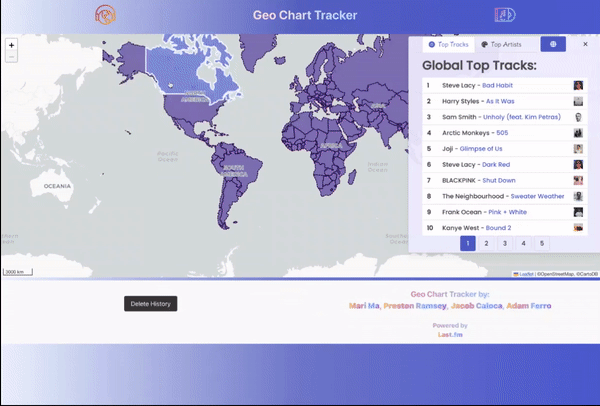

# Geo Chart Tracker

</img>

<https://jcaloca.github.io/Global-Top-Charts>

------------------------------------------------------

<a href="#description">Description</a> •
<a href="#key-features">Key Features</a> •
<a href="#usage">Usage</a> •
<a href="#technologies-used">Technologies Used</a> •
<a href="#concepts-demonstrated">Concepts Demonstrated</a> •
<a href="#authors">Authors</a>

-------------------------------------------------------

## Desktop demo:           

------------------------------------------------------

## Mobile demo:                    

------------------------------------------------------

## Description

As soon as you navigate to the application, the global top tracks are displayed. If you click the top artists tab, the global top artists are displayed. If you click on a country, that country is selected and highlighted on the map, the map zooms to that country, and the top tracks are displayed for that country. Click on the artists tab to see the top artists for that country. If you want to go back to the global top charts search when a country is selected, click the globe toggle button in the top right corner and the country will be deselected, the map will zoom out, and the global top charts are displayed. Whenever you click on a country, a button is added in a list at the bottom of the page with the name of the country on it, representing your search history. These buttons persist among sessions. When you click on a button for that country, the map zooms to that country, and the top charts are displayed for that country. Click the delete history button at the bottom of the page to clear your search history.

## Key Features

- See which tracks and artists are trending globally.
- See which tracks and artists are trending in a country, with a handy map to select each country.
- There are different tabs so the information doesn't take up the whole screen.
- Paginated results so that you can see results 41-50 without taking up the whole screen.

## Usage

Navigate to: <https://jcaloca.github.io/Global-Top-Charts>

## Technologies Used

- [BandsInTown API](https://rest.bandsintown.com/artists/)
- [last.fm API](https://www.last.fm/api)
- [LeafletJS](https://leafletjs.com/)
- [Bulma CSS](https://bulma.io/)
- [jQuery](https://jquery.com/)
- [JavaScript](https://www.javascript.com/)
- [LordIcon](https://lordicon.com/)
- CSS
- HTML

## Concepts Demonstrated

- Calling server-side APIs to get data, and then parsing and displaying that data.
- The importing and use of third-party APIs in JavaScript.
- General HTML/CSS/JavaScript syntax and purpose.
- Handling JavaScript events.
- Storing data in local storage for persistence among sessions.
- Adding and removing HTML elements on demand using the DOM.

## Authors

Mari Ma
   

[Icon credit @ Anton Kalashnyk](https://icon-icons.com/users/14quJ7FM9cYdQZHidnZoM/icon-sets/)

Preston Ramsey
- [Github](https://github.com/PRamsey02)

Jacob Caloca
- [Github](https://github.com/JCaloca)

Adam Ferro
- [Github](https://github.com/GeminiAd)
- [Linked-In](https://www.linkedin.com/in/adam-ferro)
